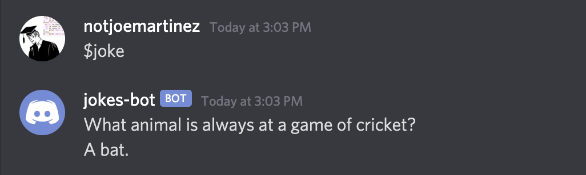

Jokes API code `jokes.py`
```python
import requests

URL = 'https://official-joke-api.appspot.com/random_joke'


def check_valid_status_code(request):
    if request.status_code == 200:
        return request.json()

    return False


def get_joke():
    request = requests.get(URL)
    data = check_valid_status_code(request)

    return data
```
Discord bot code `jokes_bot.py`
```python
import discord

client = discord.Client()


@client.event
async def on_ready():
    print('We have logged in as {0.user}'.format(client))


@client.event
async def on_message(message):
    if message.author == client.user:
        return

    if message.content.startswith('$hello'):
        await message.channel.send('Hello!')

client.run('your token here.')
```


### Adding the $joke command

The `$joke` command will allow users to request a joke from jokes API through the discord channel



Import the `jokes.py` file into your `jokes_bot.py` file by adding `import jokes` below the other import statment 

Add this to the `on_message` function in `jokes_bot.py`

```python
if message.content.startswith('$joke'):
        joke = jokes.get_joke()

        if joke == False:
            await message.channel.send("Couldn't get joke from API. Try again later.")
        else:
            await message.channel.send(joke['setup'] + '\n' + joke['punchline'])
```

